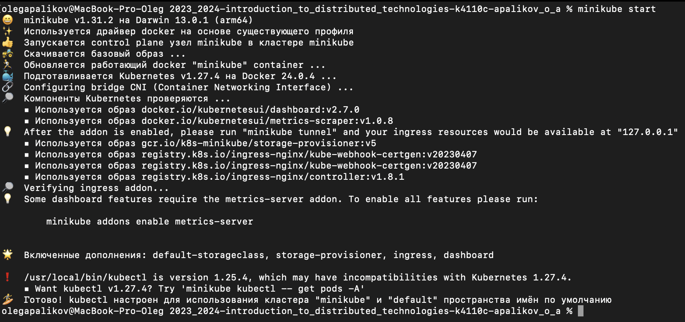
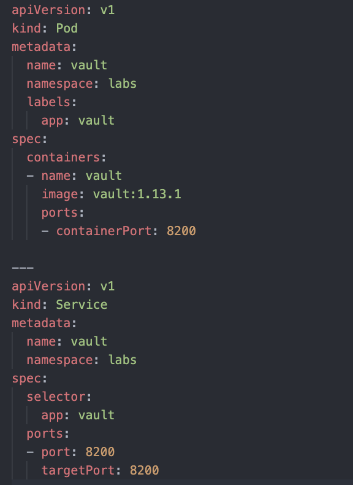
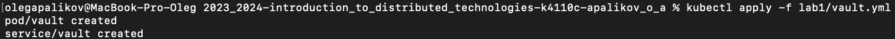
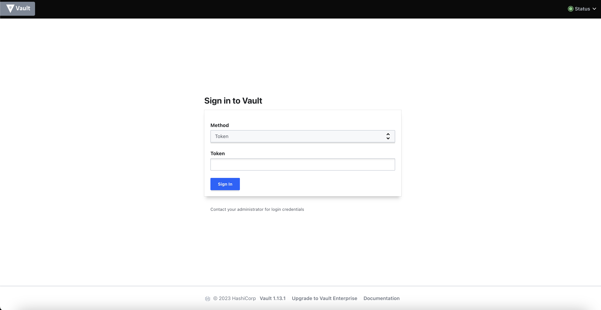
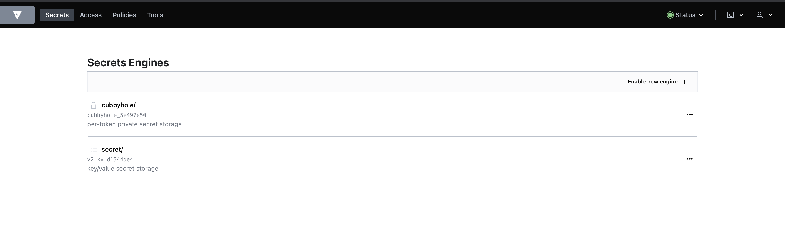
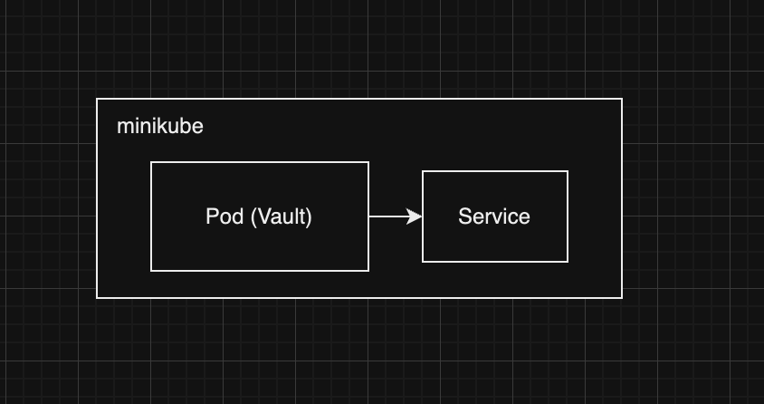

University: [ITMO University](https://itmo.ru/ru/)
Faculty: [FICT](https://fict.itmo.ru)
Course: [Introduction to distributed technologies](https://github.com/itmo-ict-faculty/introduction-to-distributed-technologies)
Year: 2023/2024
Group: K4110c
Author: Apalikov Oleg Aleksandrovich
Lab: Lab1
Date of create: 13.10.2023
Date of finished:

1. Запускаем Minikube


2. Создаем yaml с описанием Pod'а и Service


3. Разворачиваем Pod и Service в кластере Minikube с помощью команды
```
kubectl apply -f lab1/vault.yml
```


4. Пробрасываем порт 8200 и открываем Vault в браузере


5. Получаем токен из логов Pod'а
```
kubectl logs -f vault -n labs
```
6.  Авторизуемся в Vault с помощью Root Token


Ответы на вопросы:
1. Был развернуто приложение для хранения секретов Vault в minikube. Для этого был создан Pod, и Service для доступа к поду.
2. В логах пода

Схема:

