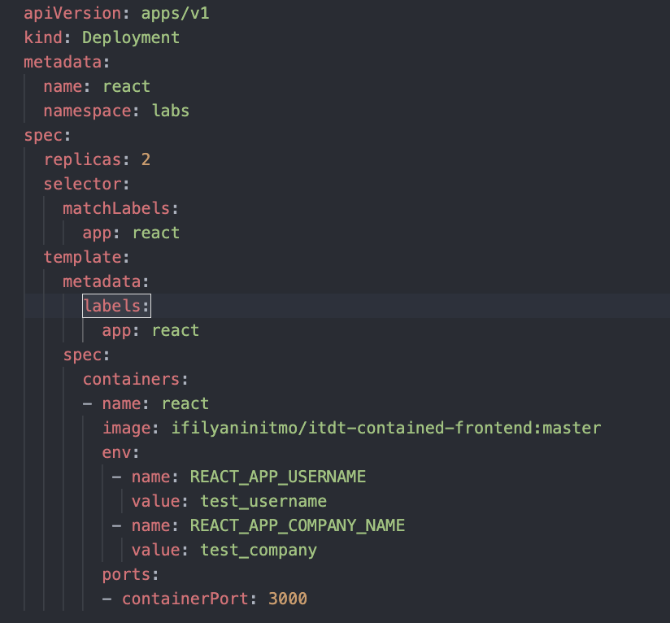
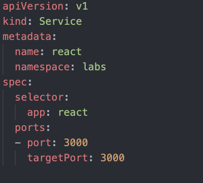
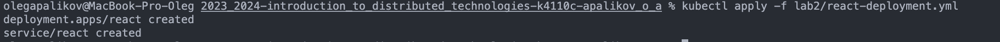
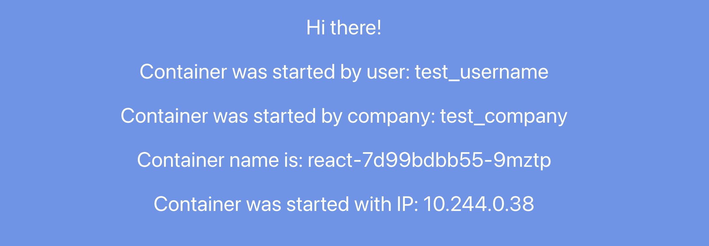
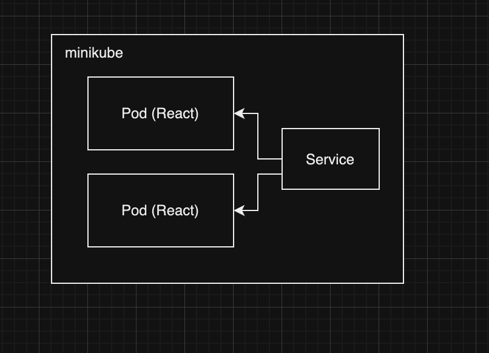

University: [ITMO University](https://itmo.ru/ru/)
Faculty: [FICT](https://fict.itmo.ru)
Course: [Introduction to distributed technologies](https://github.com/itmo-ict-faculty/introduction-to-distributed-technologies)
Year: 2023/2024
Group: K4110c
Author: Apalikov Oleg Aleksandrovich
Lab: Lab2
Date of create: 13.10.2023
Date of finished:

1. Запускаем Minikube


2. Создаем Deployment


3. Создаем Service


4. Деплоим deployment и service
```
kubectl apply -f lab2/react-deployment.yml
```


5. Прокидываем порт, открываем приложение
```
minikube kubectl -- port-forward service/react 3000:3000
```


Значения переменных REACT_APP_USERNAME и REACT_APP_COMPANY_NAME соответствуют переданным. Название и IP пода могут меняться в зависимости от того, на какой под уйдет запрос.


Логи пода:


Схема:

