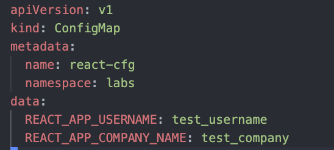
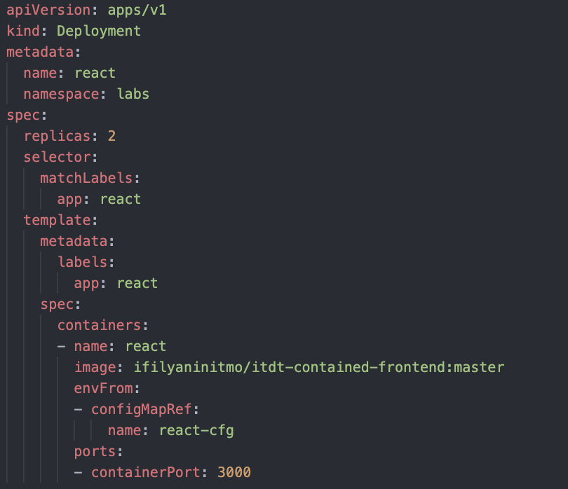
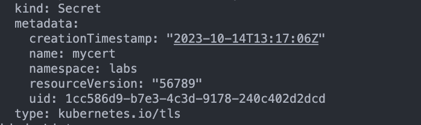
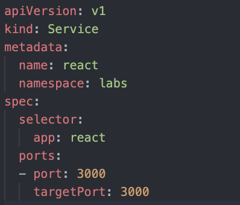
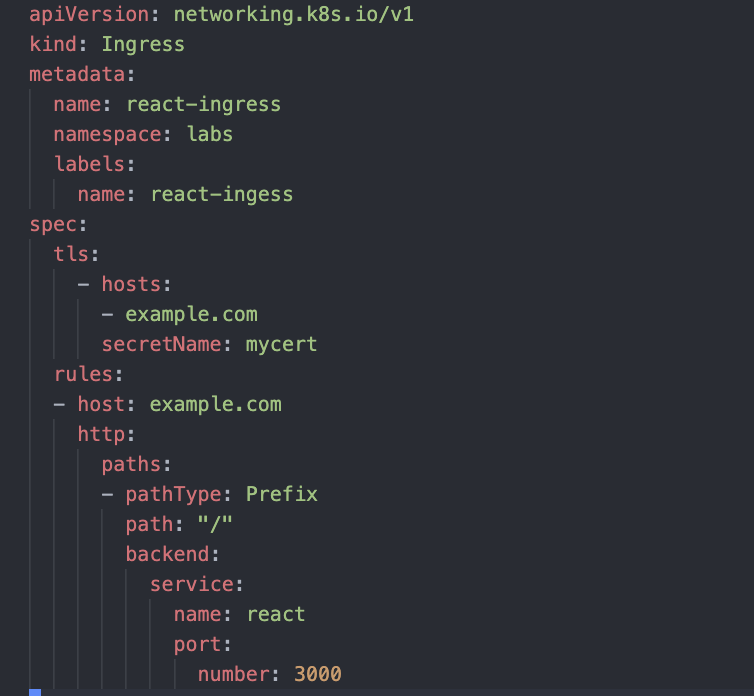
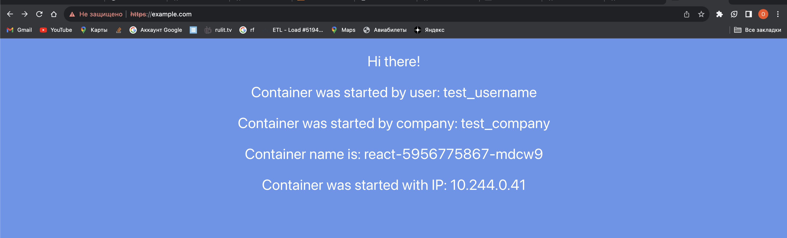
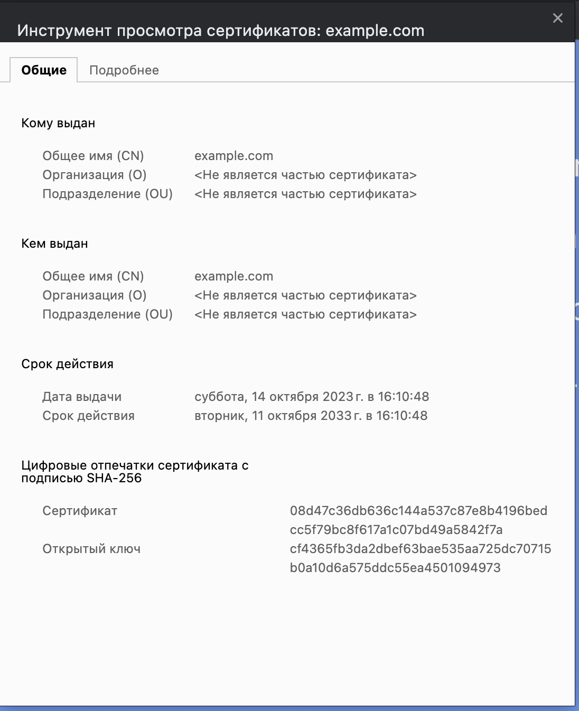
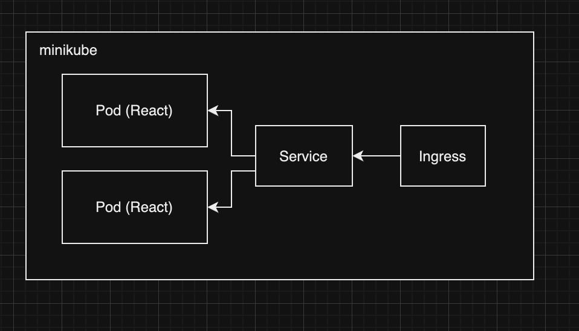

University: [ITMO University](https://itmo.ru/ru/)
Faculty: [FICT](https://fict.itmo.ru)
Course: [Introduction to distributed technologies](https://github.com/itmo-ict-faculty/introduction-to-distributed-technologies)
Year: 2023/2024
Group: K4110c
Author: Apalikov Oleg Aleksandrovich
Lab: Lab3
Date of create: 14.10.2023
Date of finished:

1. Создаем ConfigMap с переменными REACT_APP_USERNAME, REACT_APP_COMPANY_NAME


2. Создаем Deployment с 2-умя репликами


3. Создаем сгенерированный сертификат с помощью команды и монтированным ConfigMap
```
kubectl create secret tls mycert \
--cert=example.com.crt \
--key=example.com.key
```


4. Создаем сервис


5. Создаем ингресс, монтируем сертификат из секрета


6. Деплоим (для работы в MacOs в файле hosts указываем 127.0.0.1 для нашего домена)
```
kubectl apply -f lab3/react-configmap.yml
kubectl apply -f lab3/react-deployment.yml
kubectl apply -f lab3/react-ingress.yml

minikube addons enable ingress
minikube tunnel
```


7. Сертификат


Схема:

