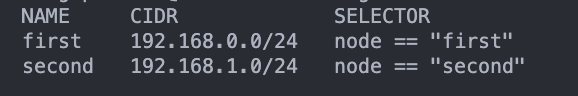

University: [ITMO University](https://itmo.ru/ru/)
Faculty: [FICT](https://fict.itmo.ru)
Course: [Introduction to distributed technologies](https://github.com/itmo-ict-faculty/introduction-to-distributed-technologies)
Year: 2023/2024
Group: K4110c
Author: Apalikov Oleg Aleksandrovich
Lab: Lab2
Date of create: 26.11.2023
Date of finished:

1. Запускаем Minikube с Calico и 2умя нодами
```
minikube start --network-plugin=cni --cni=calico --nodes 2
```


2. Проверяем наличие 2ух нод.
```
kubectl get nodes
```


3. Проверяем поды Calico
```
kubectl get pods -l k8s-app=calico-node -A
```


4. Накидываем на ноды лейблы
```
kubectl label nodes minikube node=first
kubectl label nodes minikube-m02 node=second
kubectl get nodes --show-labels
```


5. Манифест calico.yml


6. Удаляем дефолтный пул, запускаем манифекст calico.yml
```
calicoctl delete ippools default-ipv4-ippool --allow-version-mismatch
calicoctl apply -f ./calico.yml --allow-version-mismatch
```


7. Разворачивае приложение, проверяем назначенные IP адреса. Убеждаемся, что они совпадают с теми, что были заданы.
```
kubectl apply -f react-deployment.yml -n labs
kubectl get po -n labs -o wide
```


8. Подключаемся к поду, пингуем соседа. Убеждаемся в том, что все работает.


9. Прокидываем порты, проверяем в браузере. Все работает, причина по которой IP контейнера 192.168.1.2,
является перезапуск deployment'а во время оформления отчета.


Схема:
